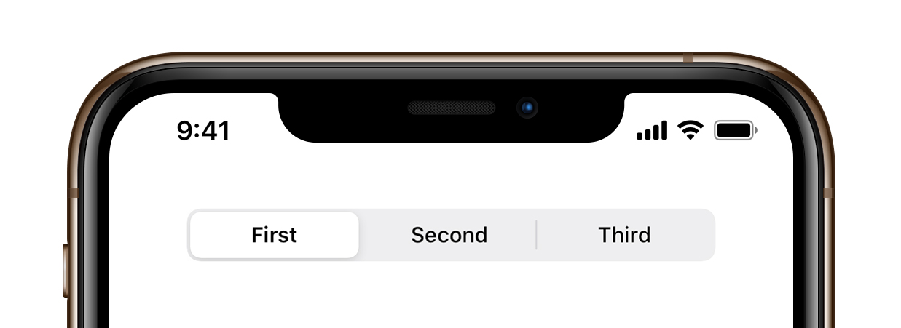

# TOSegmentedControl



[](https://buildkite.com/xd-ci/tosegmentedcontrol-run-ci)
[](http://cocoadocs.org/docsets/TOSegmentedControl)
[](https://github.com/Carthage/Carthage)
[](https://raw.githubusercontent.com/TimOliver/TOSegmentedControl/master/LICENSE)
[](http://cocoadocs.org/docsets/TOSegmentedControl)
[](https://www.paypal.com/cgi-bin/webscr?cmd=_s-xclick&hosted_button_id=M4RKULAVKV7K8)
[](http://twitch.tv/timXD)

As part of the visual improvements featured in iOS 13, `UISegmentedControl` was completely redesigned, featuring a much rounder, cleaner, and slightly more skeuomorphic appearance.

`TOSegmentedControl` is a subclass of of `UIControl` that completely re-implements the look and feel of the new `UISegmentedControl` component, allowing developers to adopt its look even in previous versions of iOS they support.

# Features

* Recreates the new look of `UISegmentedControl`, making it available on previous versions of iOS.
* Supports both text and images as segment types.
* Support for `@IBDesignable` and `@IBInspectable`.
* Configurable to dynamically add or remove items after its creation.
* Written in Objective-C, but provides full compatibility with Swift.
* Provides both a block, or `UIControlEvents` to receive when the control is tapped.
* Light and dark mode support for iOS 13.
* **(TODO)** A reversible mode where tapping the same item twice flips its direction.

# Sample Code

`TOSegmentedControl` has been written to follow the interface of `UISegmentedControl` as closely as possible. This should make it very intuitive to work with.

```Swift

let segmentedControl = SegmentedControl(items: ["First", "Second", "Third"])
segmentedControlsegmentTappedHandler = { segmentIndex, reversed in
   print("Segment \(segmentIndex) was tapped!")
}
```

## System Requirements
iOS 10.0 or above

# Installation

<details>
  <summary><strong>CocoaPods</strong></summary>

Add the following to your Podfile:
``` ruby
pod 'TOSegmentedControl'
```
</details>

<details>
  <summary><strong>Carthage</strong></summary>

1. Add the following to your Cartfile:
``` 
github "TimOliver/TOSegmentedControl"
```

2. Run `carthage update`

3. From the `Carthage/Build` folder, import the  `TOSegmentedControl.framework`.

4. Follow the remaining steps on [Getting Started with Carthage](https://github.com/Carthage/Carthage#getting-started) to finish integrating the framework.

</details>

<details>
<summary><strong>Manual Installation</strong></summary>

All of the necessary source files located in the `TOSegmentedControl` folder. Simply drag that folder into your Xcode project. 
</details>

# Credits

`TOSegmentedControl` was created by [Tim Oliver](http://twitter.com/TimOliverAU) as a component for [iComics](http://icomics.co).

iOS device mockup by [Pixeden](http://www.pixeden.com).

# License

`TOSegmentedControl` is available under the MIT license. Please see the [LICENSE](LICENSE) file for more information. 
